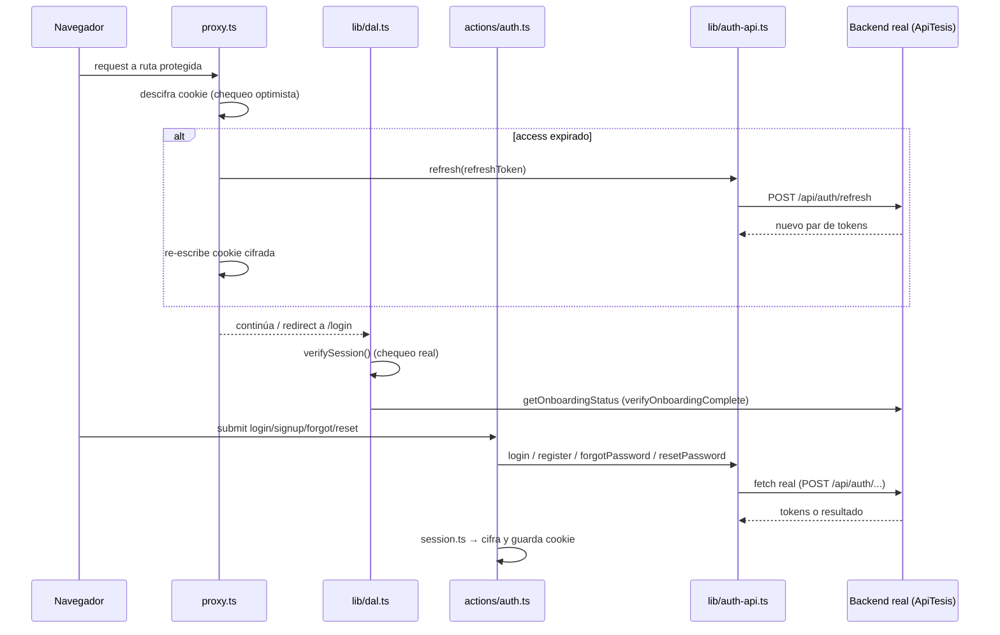

# Arquitectura del Proyecto — RecreAdmin (app-admin-react-next)

> Documento de referencia sobre cómo está compuesto el proyecto y qué patrones de diseño implementa.
> Generado a partir de una inspección del código en `c:\Dev\app-admin-react-next` (rama `develop`).
> Última actualización: revisión tras el crecimiento del proyecto con los módulos de negocio
> (disponibilidad, tarifas, espacios, financiero, reservas, soporte, configuración) e integración
> real de autenticación contra el backend (ApiTesis).

---

## 1. Visión general

Panel de administración construido con **Next.js 16 (App Router)** y **React 19**. La autenticación y
la mayoría de las features de negocio **ya están conectadas a un backend real** (ASP.NET Core Identity /
"ApiTesis", ver `docs/swagger-api-login.json` y los specs en `docs/backend-*-spec.md`). Solo quedan
restos aislados de la fase mock original (código huérfano, ver [§10](#10-código-huérfano)).

El proyecto está en una **arquitectura en transición**: conviven dos patrones para organizar features
de negocio (ver [§4](#4-capa-de-datos-y-patrones-de-feature)) — uno más antiguo (`components/<feature>/` +
`lib/<feature>-api.ts`) y uno más nuevo, tipo *feature-sliced*, en `src/modules/<feature>/`.

### Stack principal

| Categoría | Elección | Notas |
|---|---|---|
| Framework | Next.js 16.2.9 (App Router) | `middleware.ts` → `proxy.ts` (convención de Next 16) |
| UI | React 19.2.4 | `useActionState`, `useFormStatus`, `cache()` |
| Lenguaje | TypeScript (`strict: true`) | Alias `@/*` → `./src/*` |
| Estilos | Tailwind CSS v4 (`@theme` en `theme.css`) | Config CSS-first, sin `tailwind.config.js` |
| Data fetching / cache | **`@tanstack/react-query` v5** | Adoptado en `modules/*` y en `lib/pricing/hooks.ts`; **no** es global (cada feature crea su propio `QueryClient`) |
| Formularios | `react-hook-form` + `@hookform/resolvers` + Zod | Server Actions siguen usando `useActionState` + Zod directo en los flujos de auth |
| Validación | Zod v4 | Esquemas por dominio: `lib/definitions.ts`, `modules/*/schemas/`, `lib/pricing/schemas.ts` |
| Auth / JWT | `jose` | JWT del backend + JWE para la cookie de sesión propia |
| Mapas | `leaflet` + `react-leaflet` | OpenStreetMap, no Google Maps (`components/ui/MapPicker.tsx`) |
| Subida de archivos | `@aws-sdk/client-s3` + `s3-request-presigner` | Presigned URLs vía `api/upload/presign` |
| Notificaciones UI | `sonner` (toasts) | Montado en el root layout |
| HTTP | `fetch` nativo (mayoría) + `axios` en dependencias | `axios` está instalado pero no se confirmó un punto de uso concreto |
| Iconos | `lucide-react` | |
| Testing | No configurado | Sin Jest/Vitest/Playwright |
| Hosting | AWS Amplify Hosting | Solo como plataforma de despliegue (IAM role del compute); **no** se usa el SDK `aws-amplify` para auth |

---

## 2. Estructura de carpetas

```
app-admin-react-next/
├── docs/
│   ├── architecture.md                  # este documento
│   ├── backend-*-spec.md (x12)          # contratos frontend → backend
│   ├── back_requests/                   # specs adicionales pedidas al backend
│   ├── back_responses/                  # respuestas/feedback del backend
│   ├── swagger-api-login.json           # OpenAPI real del backend ("ApiTesis")
│   ├── theme_default.css / theme_pink.css   # snapshots de paleta (pre/post rebrand)
│   ├── Politicas*.txt, politica-*.md    # contenido legal
│   ├── Agora*.png                       # branding
│   └── disponibilidadui.tsx, gesti_n_de_tarifas.tsx, reservas.tsx  # prototipos sueltos, no compilados
├── src/
│   ├── proxy.ts                         # Proxy (ex-middleware): chequeo optimista de sesión
│   ├── actions/                         # Server Actions ("use server") — una por feature
│   │   ├── auth.ts, aforo.ts, availability.ts, configuracion.ts, financiero.ts,
│   │   │   negocio.ts, pricing.ts, reservas.ts, reservas-config.ts, spaces.ts,
│   │   │   tickets-soporte.ts, usuarios.ts
│   ├── app/                             # App Router
│   │   ├── layout.tsx                   # Root layout (html/body, fuente Inter, <Toaster/>)
│   │   ├── page.tsx                     # "/" → redirect según sesión/onboarding
│   │   ├── globals.css                  # @import "tailwindcss" + @import "./theme.css"
│   │   ├── theme.css                    # design tokens Tailwind v4 (paleta "pink" activa)
│   │   ├── (auth)/                      # route group PÚBLICO
│   │   │   ├── layout.tsx               # split-screen marca/formulario
│   │   │   ├── login/page.tsx
│   │   │   ├── signup/page.tsx
│   │   │   ├── forgot-password/page.tsx # NUEVO
│   │   │   └── reset-password/page.tsx  # NUEVO
│   │   ├── (portal)/                    # route group PROTEGIDO (Sidebar + Topbar)
│   │   │   ├── layout.tsx
│   │   │   ├── dashboard/page.tsx
│   │   │   ├── espacios/page.tsx            # antes "mis-espacios"
│   │   │   ├── espacios/crear/page.tsx      # NUEVO
│   │   │   ├── espacios/[id]/editar/page.tsx # NUEVO
│   │   │   ├── disponibilidad/page.tsx      # NUEVO
│   │   │   ├── tarifas/page.tsx             # NUEVO
│   │   │   ├── reservas/page.tsx            # NUEVO
│   │   │   ├── financiero/page.tsx          # NUEVO
│   │   │   ├── soporte/page.tsx             # NUEVO
│   │   │   └── configuracion/page.tsx       # NUEVO
│   │   ├── onboarding/page.tsx          # protegida, standalone (sin Sidebar/Topbar)
│   │   ├── auth/google/callback/route.ts    # NUEVO — Route Handler, canje OAuth server-to-server
│   │   ├── api/health/route.ts              # NUEVO
│   │   ├── api/upload/presign/route.ts      # NUEVO — presigned URL para S3
│   │   ├── politicas-de-privacidad/page.tsx     # NUEVO (público)
│   │   ├── politica-privacidad-app/page.tsx     # NUEVO (público)
│   │   └── terminos-y-condiciones/page.tsx      # NUEVO (público)
│   ├── components/
│   │   ├── Sidebar.tsx, Topbar.tsx      # compartidos de layout de (portal)
│   │   ├── ui/                          # NUEVO — kit compartido transversal
│   │   │   ├── AgoraLogo.tsx, HeaderSpaceSelector.tsx,
│   │   │   │   GalleryUploader.tsx, ImageUploader.tsx, MapPicker.tsx
│   │   ├── auth/                        # LoginForm, SignupForm, GoogleButton,
│   │   │   │                            # ForgotPasswordForm, ResetPasswordForm (NUEVOS)
│   │   ├── onboarding/OnboardingWizard.tsx
│   │   ├── availability/                # NUEVO — patrón "viejo" (sin modules/)
│   │   ├── pricing/                     # NUEVO — patrón "viejo" pero con React Query
│   │   └── spaces/                      # NUEVO — patrón "viejo"
│   ├── modules/                         # NUEVO — patrón feature-sliced
│   │   ├── bookings/          {components,hooks,services,schemas,types,constants,utils}/
│   │   ├── financiero/        {components,hooks,services,types,constants}/
│   │   ├── tickets-soporte/   {components,hooks,types}/       # sin services/schemas
│   │   └── configuracion/     {components,hooks,services,schemas,types,constants}/
│   ├── lib/
│   │   ├── auth-api.ts, dal.ts, definitions.ts, session.ts, session-crypto.ts
│   │   ├── spaces-api.ts, aforo-api.ts, financiero-api.ts, negocios-api.ts,
│   │   │   usuarios-api.ts, tickets-soporte-api.ts, catalogos-api.ts, dashboard-api.ts
│   │   ├── pricing/  {api.ts, hooks.ts, schemas.ts, types.ts}
│   │   ├── reservas/ {api.ts}
│   │   ├── espacio-archetype.ts         # deriva "franja_exclusiva" | "cupo_compartido"
│   │   └── availability-mock.ts         # ⚠️ huérfano (fase mock, sin referencias)
│   └── gemini/
│       ├── onboarding_host_marketplace (1).tsx   # ⚠️ huérfano
│       └── crear_espacio_wizard (1).html          # ⚠️ huérfano (nuevo)
```

---

## 3. Routing y layouts (App Router)

```mermaid
flowchart TD
    Root["RootLayout<br/>src/app/layout.tsx"]
    Root --> AuthGroup["(auth) — público"]
    Root --> PortalGroup["(portal) — protegido<br/>Sidebar + Topbar"]
    Root --> Standalone["Rutas standalone"]

    AuthGroup --> Login["/login"]
    AuthGroup --> Signup["/signup"]
    AuthGroup --> Forgot["/forgot-password"]
    AuthGroup --> Reset["/reset-password"]

    PortalGroup --> Dashboard["/dashboard"]
    PortalGroup --> Espacios["/espacios (+ crear, [id]/editar)"]
    PortalGroup --> Disponibilidad["/disponibilidad"]
    PortalGroup --> Tarifas["/tarifas"]
    PortalGroup --> Reservas["/reservas"]
    PortalGroup --> Financiero["/financiero"]
    PortalGroup --> Soporte["/soporte"]
    PortalGroup --> Configuracion["/configuracion"]

    Standalone --> Home["/ → redirect"]
    Standalone --> Onboarding["/onboarding ⛔ protegida, sin Sidebar/Topbar"]
    Standalone --> GoogleCB["/auth/google/callback (Route Handler)"]
    Standalone --> ApiHealth["/api/health"]
    Standalone --> ApiUpload["/api/upload/presign ⛔ requiere sesión"]
    Standalone --> Legal["/politicas-de-privacidad<br/>/politica-privacidad-app<br/>/terminos-y-condiciones"]
```



- `mis-espacios` fue **renombrado a `/espacios`** (la función que trae los datos en `lib/spaces-api.ts`
  conserva el nombre viejo `getMisEspacios` — deuda de naming, ver [§9](#9-brechas-y-deuda-técnica)).
- `src/proxy.ts` mantiene una lista explícita `PUBLIC_ROUTES`, ahora ampliada con `/forgot-password`,
  `/reset-password`, `/auth/google/callback` (dinámicas) y `/politicas-de-privacidad`,
  `/politica-privacidad-app`, `/terminos-y-condiciones` (estáticas, cacheables).
- Siguen sin existir `loading.tsx`, `error.tsx`, `template.tsx` ni `not-found.tsx` en ningún segmento.
- Los únicos Route Handlers (`route.ts`) son `api/health`, `api/upload/presign` y
  `auth/google/callback` — el resto de la mutación de datos sigue pasando por Server Actions.

---

## 4. Capa de datos y patrones de feature

Conviven **dos patrones** para organizar una feature de negocio. No hay todavía un estándar único —
las features más recientes/"profesionalizadas" migraron al patrón nuevo:

| Feature | Patrón | Server Actions | React Query |
|---|---|---|---|
| Reservas (`/reservas`) | **Nuevo** — `src/modules/bookings/` | `actions/reservas.ts`, `reservas-config.ts` | ✅ |
| Financiero (`/financiero`) | **Nuevo** — `src/modules/financiero/` | `actions/financiero.ts` | ✅ |
| Soporte (`/soporte`) | **Nuevo** (liviano, sin `services/`) — `src/modules/tickets-soporte/` | `actions/tickets-soporte.ts` | ✅ |
| Configuración (`/configuracion`) | **Nuevo**, pero el fetch inicial (espacios, ubicaciones) sigue en el `page.tsx` vía `lib/spaces-api.ts` | `actions/configuracion.ts`, `negocio.ts`, `reservas-config.ts` | ✅ |
| Tarifas (`/tarifas`) | **Híbrido**: `components/pricing/` + `lib/pricing/` (patrón viejo) pero ya con React Query (`lib/pricing/hooks.ts`, `PricingQueryProvider`) | `actions/pricing.ts` | ✅ |
| Espacios (`/espacios`) | **Viejo**: `components/spaces/` + `lib/spaces-api.ts`, sin React Query | `actions/spaces.ts` | ❌ |
| Disponibilidad/Aforo (`/disponibilidad`) | **Viejo**: `components/availability/`, acciones con `fetch` inline | `actions/availability.ts`, `actions/aforo.ts` (→ `lib/aforo-api.ts`) | ❌ |

### Patrón nuevo — módulo *feature-sliced* (`src/modules/<feature>/`)

```
modules/<feature>/
  components/   → Module root (crea su propio QueryClient) + subcomponentes de UI
  hooks/        → useQuery/useMutation por caso de uso
  services/     → objeto de funciones que reenvía a Server Actions (NO es una clase)
  schemas/      → validación Zod de formularios
  types/        → DTOs/interfaces del dominio
  constants/    → query keys, estilos por estado, tamaños de página
```

Ejemplo real del "Service" (`src/modules/bookings/services/BookingService.ts`) — es una fachada, no
lógica de negocio ni fetch directo:
```ts
export const BookingService = {
  async getBookings(filters) { return reservasActions.getBookings(filters); },
  // ...
};
```
Y el hook consumidor (`src/modules/bookings/hooks/useBookings.ts`):
```ts
export function useBookings(filters) {
  return useQuery({
    queryKey: BOOKING_QUERY_KEYS.list(filters),
    queryFn: () => BookingService.getBookings(filters),
  });
}
```
Cada `*Module.tsx` (`ReservasModule`, `FinancieroModule`, `TicketsSoporteModule`, `ConfiguracionModule`)
monta su **propio `QueryClientProvider`** — no hay un `QueryClient` global en `src/app/layout.tsx`, cada
feature está aislada en cache de React Query.

### Patrón viejo — `lib/<feature>-api.ts` + componentes por feature

Cliente de datos como funciones sueltas en `lib/` (p. ej. `spaces-api.ts`, `aforo-api.ts`,
`pricing/api.ts`), consumidas directamente desde Server Actions o desde Server Components de página, con
la UI en `src/components/<feature>/`.

### Capa de auth (no forma parte de ninguno de los dos patrones anteriores — es transversal)

`src/lib/auth-api.ts`, `dal.ts`, `session.ts`, `session-crypto.ts` — ver [§6](#6-autenticación).

---

## 5. Gestión de estado

- **Server state / cache remoto**: **React Query** (`@tanstack/react-query` v5) en las features nuevas
  y en Tarifas. Cada feature crea su propio `QueryClient` (sin provider global), aislando el cache por
  módulo.
- **Sesión de usuario**: sigue sin pasar por store cliente — `verifySession()`/`getCurrentUser()`
  (`src/lib/dal.ts`), memoizadas por request con `cache()` de React.
- **Formularios**:
  - Flujos de auth (`LoginForm`, `SignupForm`, `ForgotPasswordForm`, `ResetPasswordForm`) usan
    `useActionState` + Zod directo contra la Server Action.
  - Formularios de las features nuevas usan `react-hook-form` + `@hookform/resolvers` (puente con Zod).
- **Estado de UI local**: `useState`/`useEffect`/`useRef` para wizards y paneles (`OnboardingWizard`,
  `CrearEspacioWizard`, `EditarEspacioWizard`, `AvailabilityPage`).
- **Notificaciones**: `sonner` (toast) para feedback de mutaciones (éxito/error), montado globalmente en
  `src/app/layout.tsx` y usado desde `onSuccess`/`onError` de las mutaciones de React Query.

Sigue sin haber Redux/Zustand/Recoil ni `createContext` custom para estado de aplicación.

---

## 6. Autenticación

**Ya no es mock**: integración real contra un backend ASP.NET Core Identity (proyecto "ApiTesis", ver
`docs/swagger-api-login.json`). La arquitectura en capas se mantiene, pero cada capa ahora habla con el
backend real:



**Login con Google — flujo OAuth real de 2 pasos** (ya no es upsert simulado):
1. `authApi.googleAuthUrl()` redirige al backend, que gestiona el consentimiento con Google.
2. El backend redirige a `src/app/auth/google/callback/route.ts` con `?code=...` (código de un solo
   uso, ~60s) o `?error=...`.
3. El Route Handler canjea el código **server-to-server** (`authApi.exchangeGoogleCode(code)`), crea la
   sesión (`createSession(tokens)`) y redirige a `/onboarding`.

**Forgot / Reset password** (nuevo): `ForgotPasswordForm` → `actions/auth.ts::forgotPassword` → backend
(siempre responde 200, no filtra si el correo existe — evita enumeración de usuarios);
`ResetPasswordForm` → `resetPassword` con token de un solo uso enviado por correo.

**Se mantiene sin cambios el diseño de defensa en profundidad** ya documentado antes: Proxy = chequeo
optimista de UX; DAL = única fuente real de verdad de identidad/autorización; cookie `session` httpOnly,
`secure` en producción, payload cifrado con JWE (no solo firmado).

> ⚠️ Aclaración sobre el historial de commits: varios commits llamados "Auth Amplify" en el git log en
> realidad corresponden a trabajo del módulo de reservas/disponibilidad (mensaje de commit engañoso, no
> refleja el contenido). **No hay SDK de AWS Amplify en el proyecto** (`aws-amplify` no está en
> `package.json`); las menciones a "Amplify" en el código son comentarios sobre el *hosting* (IAM role
> del compute donde corre la app), no sobre autenticación.

---

## 7. Componentes

- **`src/components/ui/` (nuevo)** — kit compartido transversal, fuera de cualquier feature:
  - `AgoraLogo.tsx` — logo de marca.
  - `HeaderSpaceSelector.tsx` — selector de espacio en headers.
  - `ImageUploader.tsx` / `GalleryUploader.tsx` — subida a S3 vía presigned URL
    (`POST /api/upload/presign`, valida tipo jpg/png/webp y tamaño máx. 5MB).
  - `MapPicker.tsx` — mapa con **Leaflet + OpenStreetMap** (no Google Maps), centrado en Ecuador,
    marcador draggable; usa la API imperativa de `leaflet` directamente aunque `react-leaflet` está
    instalado.
- El resto de la organización (por feature en `components/<feature>/`, naming `PascalCase.tsx`, named
  exports, distinción `"use client"` explícita) se mantiene igual que antes — ver también los nuevos
  `components/availability/`, `components/pricing/`, `components/spaces/` que siguen esta misma
  convención (patrón "viejo", sin `modules/`).

---

## 8. Patrones de diseño identificados

| Patrón | Dónde | Notas |
|---|---|---|
| **Data Access Layer (DAL)** | `src/lib/dal.ts` | Sin cambios de diseño; ahora consulta también estado de onboarding contra el backend real. |
| **Repository / Gateway** | `src/lib/auth-api.ts`, `spaces-api.ts`, `aforo-api.ts`, `pricing/api.ts`, etc. | Firma estable, ahora con `fetch` real (no mock) contra el backend. |
| **Service Facade (nuevo)** | `src/modules/*/services/*Service.ts` | Objeto de funciones que reenvía 1:1 a Server Actions — desacopla los hooks de React Query del import directo de `actions/`. |
| **Feature-sliced module (nuevo)** | `src/modules/bookings`, `financiero`, `tickets-soporte`, `configuracion` | `components/hooks/services/schemas/types/constants` por feature, con `QueryClient` propio por módulo. |
| **Middleware / Proxy pipeline** | `src/proxy.ts` | `PUBLIC_ROUTES` ampliada; mismo diseño. |
| **Guard / gatekeeper vía Server Component** | `(portal)/layout.tsx` | Sin cambios. |
| **OAuth code exchange server-to-server (nuevo)** | `src/app/auth/google/callback/route.ts` | Route Handler que intercambia el código por tokens sin exponerlos nunca al navegador. |
| **Presigned URL upload (nuevo)** | `api/upload/presign/route.ts` + `components/ui/ImageUploader.tsx` | El servidor solo firma la URL; el binario va directo del navegador a S3. |
| **Memoization / request-scoped cache** | `dal.ts` (`cache()`) | Sin cambios. |
| **Discriminated union de dominio** | `Space["status"]`, `espacio-archetype.ts` (`"franja_exclusiva" \| "cupo_compartido"`) | El "archetype" deriva de `modalidadReserva` y se reutiliza en reservas/disponibilidad/tarifas. |
| **Validación centralizada con Zod** | `lib/definitions.ts`, `modules/*/schemas/`, `lib/pricing/schemas.ts` | Ahora también integrada con `react-hook-form` vía `@hookform/resolvers`. |
| **Server state cache (React Query, nuevo)** | `modules/*/hooks/*`, `lib/pricing/hooks.ts` | `QueryClient` por feature (no global); `queryKey` centralizadas en `constants/`. |

**No detectados**: HOCs, render props, compound components, factories formales (clases), Context API
custom para estado de aplicación.

---

## 9. Theming

- `src/app/globals.css` → `@import "tailwindcss"` + `@import "./theme.css"` (Tailwind v4, config
  CSS-first, sin `tailwind.config.js`).
- `src/app/theme.css` define tokens en `@theme { --color-primary: ...; }` (generan utilidades Tailwind
  automáticamente) más clases semánticas en `@layer components` (`.page-title`, `.brand-title`, etc.).
- El archivo **activo** (`src/app/theme.css`) coincide con `docs/theme_pink.css`
  (`--color-primary: #151b2d`, `--color-secondary: #fd548a`) — paleta post-rebrand ("plantilla pink").
  `docs/theme_default.css` (`--color-primary: #1e3a5f`, `--color-secondary: #14b8a6`) es la paleta
  **original**, conservada como snapshot/backup.
- **No hay theming dinámico en runtime**: no existe `ThemeProvider` ni `data-theme` en `src/`. Los
  archivos en `docs/theme_*.css` son documentación de respaldo del rebrand, no infraestructura activa.

---

## 10. Código huérfano

Sin cambios de fondo respecto a la revisión anterior, pero creció:

- `src/gemini/onboarding_host_marketplace (1).tsx` — sin referencias.
- `src/gemini/crear_espacio_wizard (1).html` (**nuevo**) — `.html` suelto, ni siquiera sería compilado
  por el App Router; sin referencias.
- `src/lib/availability-mock.ts` (**nuevo huérfano**) — quedó de la fase 100% mock; `disponibilidad`
  ahora usa `actions/availability.ts` con `fetch` real. Candidato a eliminar.
- `docs/disponibilidadui.tsx`, `docs/gesti_n_de_tarifas.tsx`, `docs/reservas.tsx` — prototipos `.tsx`
  sueltos en `docs/` (no en `src/`), fuera del árbol compilable; útiles como referencia de diseño pero
  vale la pena aclarar en el propio repo que son mockups, no código vivo.

---

## 11. Configuración y calidad

Sin cambios respecto a la revisión anterior en TypeScript/ESLint/build; lo nuevo:

- **Variables de entorno**: se mantiene `SESSION_SECRET`; `API_BASE_URL` ya no está comentado — el
  proyecto depende de él para hablar con el backend real. Revisar `.env.local` para el resto
  (credenciales AWS para S3 se resuelven vía IAM role en Amplify Hosting, no por env var explícita).
- **Sigue sin haber testing configurado** (Jest/Vitest/Playwright/Cypress) — ahora con bastante más
  superficie crítica (pagos/facturación, reservas, auth real) sin cobertura automatizada.

---

## 12. Brechas y deuda técnica a considerar

1. **Dos patrones de feature conviviendo** (`src/modules/` vs `components/<feature>/` + `lib/<feature>-api.ts`)
   sin una decisión documentada de cuál es el estándar final — evaluar si conviene migrar `espacios` y
   `disponibilidad` al patrón de módulos, o si el patrón viejo se mantiene deliberadamente para features
   más simples.
2. **`getMisEspacios`** en `src/lib/spaces-api.ts` conserva el nombre de la ruta vieja (`/mis-espacios`,
   ahora `/espacios`) — deuda de naming menor.
3. **Código huérfano acumulado**: ver [§10](#10-código-huérfano) — 4 archivos sin referencias
   (2 en `src/gemini/`, `lib/availability-mock.ts`, y los 3 prototipos en `docs/`).
4. **`axios` instalado sin punto de uso confirmado** — todos los `lib/*-api.ts` revisados usan `fetch`
   nativo; vale la pena confirmar si `axios` es necesario o se puede retirar.
5. **Sin tests** en ninguna capa — crítico dado que ya hay dinero real involucrado (financiero, pagos,
   facturación electrónica SRI) y autenticación real (JWE, refresh, OAuth).
6. **Sin `error.tsx`/`loading.tsx`/`not-found.tsx`** en ningún segmento de `app/` — sigue pendiente.
7. **Snapshots de tema en `docs/`** (`theme_default.css`/`theme_pink.css`) son backups manuales, no
   versión controlada de un sistema de theming — si se planea soportar más de una marca/tema, conviene
   formalizarlo (`ThemeProvider` + tokens por tema) en vez de archivos sueltos.
