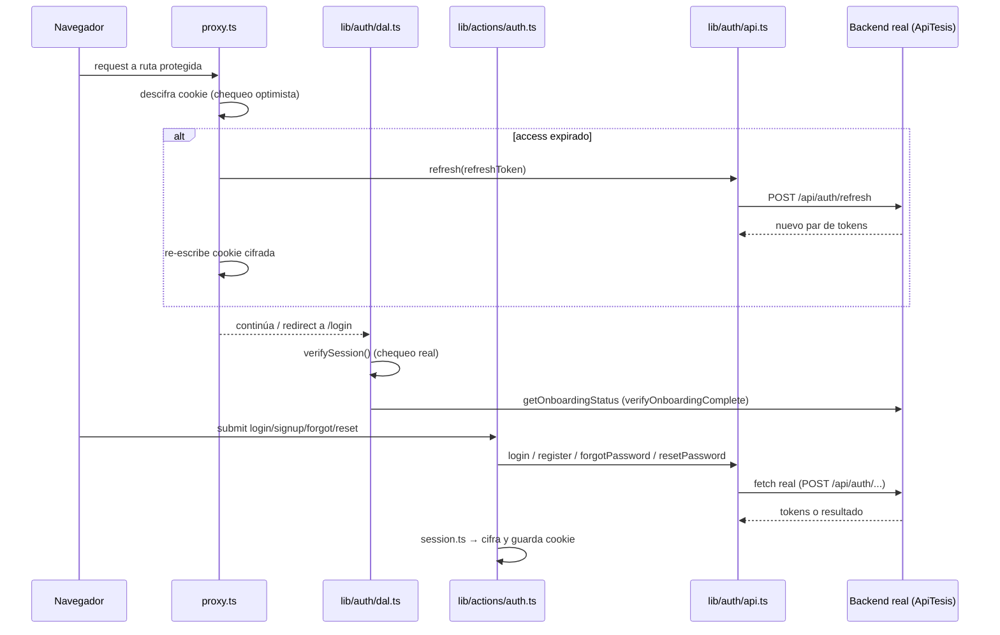

# Arquitectura del Proyecto — RecreAdmin (app-admin-react-next)

> Documento de referencia sobre cómo está compuesto el proyecto y qué patrones de diseño implementa.
> Refleja el estado del código a **2026-08-12**.
>
> Última revisión: **los slices verticales están completos**. Antes, cada dominio vivía repartido en
> tres carpetas (`modules/<f>/` + `actions/<f>.ts` + `lib/<f>-api.ts`) y solo la capa cliente estaba
> cortada en vertical; ahora cada dominio se lleva su `actions/` y su `api/` adentro, expone una API
> pública por `index.ts`, y `lib/` quedó reducido a lo transversal. Ver
> [§4](#4-capa-de-datos-y-patrones-de-feature).

---

## 1. Visión general

Panel de administración construido con **Next.js 16 (App Router)** y **React 19**. La autenticación y
la mayoría de las features de negocio **ya están conectadas a un backend real** (ASP.NET Core Identity /
"ApiTesis", ver `docs/swagger-api-login.json` y los specs en `docs/backend-*-spec.md`). Solo quedan
restos aislados de la fase mock original (código huérfano, ver [§10](#10-código-huérfano)).

**Decisión de arquitectura vigente:** el estándar del proyecto es el patrón *feature-sliced* en
`src/modules/<feature>/`, y **cada dominio vive completo ahí dentro**: componentes, hooks, Server
Actions y transporte. Las reglas están en [§4](#4-capa-de-datos-y-patrones-de-feature) y son de
cumplimiento obligatorio para features nuevas.

> **Por qué las Server Actions y el `fetch` viven dentro del módulo.** La frontera servidor/cliente
> la marcan las directivas **por archivo** (`"use server"`, `import "server-only"`), no la ubicación
> en el árbol. Por eso ubicar un archivo en `modules/pricing/` en vez de en `actions/` no cambia
> dónde se ejecuta, y deja la carpeta libre para expresar el dominio. Hubo un período en que se
> asumió lo contrario y `actions/` + `lib/` estaban cortados en horizontal; ver
> [§4](#4-capa-de-datos-y-patrones-de-feature).
>
> `server-only` **no está ni debe estar en `package.json`**: Next.js lo resuelve con un alias de
> compilación (`server-only$` → `next/dist/compiled/server-only`, ver
> `node_modules/next/dist/build/create-compiler-aliases.js`). Instalarlo añadiría un paquete que el
> alias nunca usaría.

### Stack principal

| Categoría | Elección | Notas |
|---|---|---|
| Framework | Next.js 16.2.9 (App Router) | `middleware.ts` → `proxy.ts` (convención de Next 16) |
| UI | React 19.2.4 | `useActionState`, `useFormStatus`, `cache()` |
| Lenguaje | TypeScript (`strict: true`) | Alias `@/*` → `./src/*` |
| Estilos | Tailwind CSS v4 (`@theme` en `theme.css`) | Config CSS-first, sin `tailwind.config.js` |
| Data fetching / cache | **`@tanstack/react-query` v5** | Un único `QueryClientProvider` global montado en `(portal)/layout.tsx` |
| Formularios | `react-hook-form` + `@hookform/resolvers` + Zod | Server Actions siguen usando `useActionState` + Zod directo en los flujos de auth |
| Validación | Zod v4 | Esquemas por dominio: `lib/auth/definitions.ts` (auth) y `modules/*/schemas/` |
| Auth / JWT | `jose` | JWT del backend + JWE para la cookie de sesión propia |
| Mapas | `leaflet` + `react-leaflet` | OpenStreetMap, no Google Maps (`components/ui/MapPicker.tsx`) |
| Subida de archivos | `@aws-sdk/client-s3` + `s3-request-presigner` | Presigned URLs vía `api/upload/presign` |
| Notificaciones UI | `sonner` (toasts) | Montado en el root layout |
| HTTP | `fetch` nativo (mayoría) + `axios` en dependencias | `axios` está instalado pero no se confirmó un punto de uso concreto |
| Iconos | `lucide-react` | |
| Testing | No configurado | Sin Jest/Vitest/Playwright |
| Hosting | AWS Amplify Hosting | Solo como plataforma de despliegue (IAM role del compute); **no** se usa el SDK `aws-amplify` para auth |

---

## 2. Estructura de carpetas

```
app-admin-react-next/
├── docs/
│   ├── architecture.md                  # este documento
│   ├── backend-*-spec.md (x12)          # contratos frontend → backend
│   ├── back_requests/                   # specs adicionales pedidas al backend
│   ├── back_responses/                  # respuestas/feedback del backend
│   ├── swagger-api-login.json           # OpenAPI real del backend ("ApiTesis")
│   ├── theme_default.css / theme_pink.css   # snapshots de paleta (pre/post rebrand)
│   ├── Politicas*.txt, politica-*.md    # contenido legal
│   ├── Agora*.png                       # branding
│   └── disponibilidadui.tsx, gesti_n_de_tarifas.tsx, reservas.tsx  # prototipos sueltos, no compilados
├── src/
│   ├── proxy.ts                         # Proxy (ex-middleware): chequeo optimista de sesión
│   ├── app/                             # App Router
│   │   ├── layout.tsx                   # Root layout (html/body, fuente Inter, <Toaster/>)
│   │   ├── page.tsx                     # "/" → redirect según sesión/onboarding
│   │   ├── globals.css                  # @import "tailwindcss" + @import "./theme.css"
│   │   ├── theme.css                    # design tokens Tailwind v4 (paleta "pink" activa)
│   │   ├── (auth)/                      # route group PÚBLICO
│   │   │   ├── layout.tsx               # split-screen marca/formulario
│   │   │   ├── login/page.tsx
│   │   │   ├── signup/page.tsx
│   │   │   ├── forgot-password/page.tsx
│   │   │   └── reset-password/page.tsx
│   │   ├── (portal)/                    # route group PROTEGIDO (Sidebar + Topbar)
│   │   │   ├── layout.tsx
│   │   │   ├── dashboard/page.tsx
│   │   │   ├── espacios/page.tsx            # antes "mis-espacios"
│   │   │   ├── espacios/crear/page.tsx
│   │   │   ├── espacios/[id]/editar/page.tsx
│   │   │   ├── disponibilidad/page.tsx
│   │   │   ├── tarifas/page.tsx
│   │   │   ├── reservas/page.tsx
│   │   │   ├── financiero/page.tsx
│   │   │   ├── soporte/page.tsx
│   │   │   └── configuracion/page.tsx
│   │   ├── onboarding/page.tsx          # protegida, standalone (sin Sidebar/Topbar)
│   │   ├── auth/google/callback/route.ts    # Route Handler, canje OAuth server-to-server
│   │   ├── api/health/route.ts
│   │   ├── api/upload/presign/route.ts      # presigned URL para S3
│   │   ├── politicas-de-privacidad/page.tsx     # público
│   │   ├── politica-privacidad-app/page.tsx     # público
│   │   └── terminos-y-condiciones/page.tsx      # público
│   ├── components/                      # SOLO transversal — nada de features de negocio
│   │   ├── Sidebar.tsx, Topbar.tsx      # layout de (portal)
│   │   ├── providers/
│   │   │   └── QueryProvider.tsx        # ÚNICO QueryClientProvider de la app
│   │   ├── ui/                          # kit compartido
│   │   │   ├── AgoraLogo.tsx, HeaderSpaceSelector.tsx,
│   │   │   │   GalleryUploader.tsx, ImageUploader.tsx, MapPicker.tsx
│   │   ├── auth/                        # LoginForm, SignupForm, GoogleButton,
│   │   │   │                            # ForgotPasswordForm, ResetPasswordForm
│   │   └── onboarding/OnboardingWizard.tsx
│   ├── modules/                         # patrón feature-sliced (estándar del proyecto)
│   │   │                                # cada uno con index.ts = API pública del módulo
│   │   ├── availability/      {actions,api,components,hooks,types,constants,utils}/
│   │   ├── bookings/          {actions,api,components,hooks,schemas,types,constants,utils}/
│   │   ├── configuracion/     {actions,api,components,hooks,schemas,types,constants}/
│   │   ├── financiero/        {actions,api,components,hooks,types,constants}/
│   │   ├── pricing/           {actions,api,components,hooks,schemas,types,constants}/
│   │   ├── dashboard/         {api,components,constants,types,utils}/  # sin hooks (ver §4)
│   │   ├── spaces/            {actions,api,components}/   # sin hooks: usa revalidatePath
│   │   └── tickets-soporte/   {actions,api,components,hooks,types,constants}/
│   ├── lib/                             # SOLO transversal, separado por rol
│   │   ├── actions/  auth.ts, usuarios.ts, catalogo-espacios.ts
│   │   │                                # Server Actions que no pertenecen a un dominio
│   │   ├── auth/     api.ts, dal.ts, session.ts, session-crypto.ts, definitions.ts
│   │   ├── api/      spaces.ts, catalogos.ts, usuarios.ts,
│   │   │             espacios-catalogo.ts   # único cargador del catálogo (ver §4)
│   │   │                                # transporte que consumen varios dominios
│   │   │                                # (o ninguno: dashboard aún no tiene módulo)
│   │   └── domain/   espacio-archetype.ts, pagination.ts, espacio.ts + index.ts
│   │                                    # vocabulario compartido por 2+ dominios
│   └── gemini/
│       ├── onboarding_host_marketplace (1).tsx   # ⚠️ huérfano
│       └── crear_espacio_wizard (1).html          # ⚠️ huérfano
```

---

## 3. Routing y layouts (App Router)

```mermaid
flowchart TD
    Root["RootLayout<br/>src/app/layout.tsx"]
    Root --> AuthGroup["(auth) — público"]
    Root --> PortalGroup["(portal) — protegido<br/>Sidebar + Topbar"]
    Root --> Standalone["Rutas standalone"]

    AuthGroup --> Login["/login"]
    AuthGroup --> Signup["/signup"]
    AuthGroup --> Forgot["/forgot-password"]
    AuthGroup --> Reset["/reset-password"]

    PortalGroup --> Dashboard["/dashboard"]
    PortalGroup --> Espacios["/espacios (+ crear, [id]/editar)"]
    PortalGroup --> Disponibilidad["/disponibilidad"]
    PortalGroup --> Tarifas["/tarifas"]
    PortalGroup --> Reservas["/reservas"]
    PortalGroup --> Financiero["/financiero"]
    PortalGroup --> Soporte["/soporte"]
    PortalGroup --> Configuracion["/configuracion"]

    Standalone --> Home["/ → redirect"]
    Standalone --> Onboarding["/onboarding ⛔ protegida, sin Sidebar/Topbar"]
    Standalone --> GoogleCB["/auth/google/callback (Route Handler)"]
    Standalone --> ApiHealth["/api/health"]
    Standalone --> ApiUpload["/api/upload/presign ⛔ requiere sesión"]
    Standalone --> Legal["/politicas-de-privacidad<br/>/politica-privacidad-app<br/>/terminos-y-condiciones"]
```



- `mis-espacios` fue **renombrado a `/espacios`** (la función que trae los datos en `lib/api/spaces.ts`
  conserva el nombre viejo `getMisEspacios` — deuda de naming, ver
  [§12](#12-brechas-y-deuda-técnica-a-considerar)).
- `src/proxy.ts` mantiene una lista explícita `PUBLIC_ROUTES`, ahora ampliada con `/forgot-password`,
  `/reset-password`, `/auth/google/callback` (dinámicas) y `/politicas-de-privacidad`,
  `/politica-privacidad-app`, `/terminos-y-condiciones` (estáticas, cacheables).
- Siguen sin existir `loading.tsx`, `error.tsx`, `template.tsx` ni `not-found.tsx` en ningún segmento.
- Los únicos Route Handlers (`route.ts`) son `api/health`, `api/upload/presign` y
  `auth/google/callback` — el resto de la mutación de datos sigue pasando por Server Actions.

---

## 4. Capa de datos y patrones de feature

### Las tres capas (regla general)

Toda feature se organiza en **tres capas**, y las tres viven **dentro del módulo**:

| Capa | Ubicación | Rol |
|---|---|---|
| Transporte | `modules/<f>/api/` (`import "server-only"`) | `fetch` al backend, tipos `*Api`, errores tipados |
| Servidor | `modules/<f>/actions/` (`"use server"`) | auth (token de sesión), validación Zod, mapeo `*Api` → dominio |
| Cliente | `modules/<f>/hooks/` | React Query: `useQuery`/`useMutation`, invalidación, toasts |

> **No existe una capa `services/`.** Se eliminó por ser una fachada 1:1 sobre las Server Actions que no
> agregaba comportamiento. Los hooks importan las actions directamente
> (`import * as reservasActions from "../actions/reservas"`).

### Estructura de un módulo

```
modules/<feature>/
  index.ts      → API PÚBLICA: lo único importable desde fuera del módulo
  components/   → componente raíz de la feature + subcomponentes de UI
  hooks/        → useQuery/useMutation por caso de uso, llamando a ../actions/
  actions/      → Server Actions ("use server") del dominio
  api/          → transporte (import "server-only"), tipos *Api
  schemas/      → validación Zod de formularios
  types/        → modelo de dominio del frontend
  constants/    → query keys (<feature>Keys), estilos por estado, tamaños de página
```

### Las tres reglas de aislamiento

1. **Un módulo no importa de otro.** Si dos dominios necesitan lo mismo, sube a `lib/`: `domain/` si
   es vocabulario, `api/` si es transporte, `actions/` si es una Server Action. Precedente:
   `getSpaceOptions` vivía en la action de reservas y financiero la importaba de ahí; se movió a
   `lib/actions/catalogo-espacios.ts`.
2. **Desde fuera solo se importa el barril** (`@/modules/bookings`), nunca una ruta interna
   (`@/modules/bookings/components/...`). El `index.ts` es lo que hace la regla 1 exigible en vez de
   confiada a la memoria.
3. **`lib/` es solo transversal.** Algo baja ahí únicamente si lo consumen **dos o más** dominios —
   como `api/spaces.ts`, que usan 6 páginas y 3 módulos, y que por eso **no** pertenece a
   `modules/spaces/`. El corolario inverso también aplica: en cuanto algo de `lib/` queda con un
   único dominio consumidor, baja al módulo.

> **`lib/` no es "la zona del servidor".** Sus cuatro subcarpetas tienen contratos distintos y
> conviene no confundirlos: `api/` es `server-only`; `actions/` es `"use server"` (**cada export es
> un endpoint alcanzable desde el navegador**); `auth/` mezcla ambos (`dal`, `session` y `api` son
> server-only, `definitions` es isomorfo); `domain/` es isomorfo y lo importan 7 componentes
> `"use client"`. Al añadir un archivo, la pregunta no es "¿es de servidor?" sino "¿quién puede
> invocarlo?".

**Superficie RPC de la app**: todo lo alcanzable desde el navegador vive en un `*/actions/*` — hoy
13 archivos, 3 en `lib/actions/` y 10 en los módulos. Es el patrón a auditar cuando importe.

### Modelo dual: transporte vs dominio (capa anticorrupción)

El proyecto mantiene **dos modelos de datos deliberadamente separados**, con un traductor entre ellos:

| | Vocabulario | Ejemplos |
|---|---|---|
| **Transporte** (`api/`) | el del backend, sufijo `*Api` | `ReservaResponseApi`, `EstadoPagoApi`, `SlotApi` |
| **Dominio** (`types/`) | el del frontend, sin sufijo | `Booking`, `PaymentStatus`, `Block` |

La traducción vive en `actions/` (`toBooking`, `toBlock`, `toSchedule`). Es una **capa
anticorrupción**: si el backend renombra `estadoPago`, el golpe se absorbe en una función de mapeo
en vez de propagarse a los componentes. Al tocar un endpoint, ajustar el tipo `*Api` y su `to*` —
nada más debería cambiar.

### El catálogo de espacios se carga en un solo sitio

`modalidadReserva` no vive en el espacio sino en su **tipo**, así que el catálogo necesita un join
(`espacioId → tipoEspacioId → modalidadReserva`). Ese join se hacía a mano en tres sitios; ahora
existe una sola implementación, en dos puertas:

| Función | Quién la usa | Por qué |
|---|---|---|
| `loadEspacioOptions(accessToken)` (`lib/api/espacios-catalogo.ts`) | Server Components y actions de dominio | ya tienen el token en mano |
| `getSpaceOptions()` (`lib/actions/catalogo-espacios.ts`) | hooks de React Query | el cliente no tiene token |

> **Por qué son dos y no una.** `getSessionTokens()` descifra el JWE en cada llamada y **no** está
> memoizada con `cache()`, así que hacer que el servidor pase por la action añadiría un descifrado
> por request. Y la action no puede aceptar el token como argumento: en un archivo `"use server"`
> **todo export es invocable desde el navegador**, así que un parámetro `accessToken` sería un
> agujero, no una optimización.

`EspacioOption` es el destino único de ese cargador y el tipo `Espacio` de availability es un
re-export suyo. Si necesitas otro campo del espacio en una pantalla, añádelo ahí — no vuelvas a
componer el join.

**El id de espacio es `number` en todo el dominio**, que es la forma real del backend
(`EspacioResponse.id`). La conversión contra el `string` que impone el DOM ocurre en **un solo
sitio**: `components/ui/HeaderSpaceSelector.tsx`. Ningún otro punto debe hacer `String()`/`Number()`
sobre un id de espacio; las conversiones que quedan en el código son de `URLSearchParams`, que
siempre exige strings.

Ejemplo (`src/modules/bookings/hooks/useBookings.ts`):
```ts
export function useBookings(filters: BookingFilters = {}) {
  return useQuery({
    queryKey: bookingKeys.list(filters),
    queryFn: () => reservasActions.getBookings(filters),
    staleTime: 1000 * 30,
    placeholderData: (prev) => prev,
  });
}
```

### El shell de la página (común a todas las features)

El `page.tsx` es siempre un Server Component que verifica sesión, hace el fetch inicial y pasa los
datos como props al componente cliente. Este patrón es igual en las 8 features.

```tsx
export default async function ReservasPage() {
  await verifySession();
  // …fetch inicial opcional
  return <ReservasModule />;
}
```

### Mapa de features

| Feature | Ubicación de la UI | React Query |
|---|---|---|
| Reservas (`/reservas`) | ✅ `modules/bookings/` | ✅ |
| Financiero (`/financiero`) | ✅ `modules/financiero/` | ✅ |
| Soporte (`/soporte`) | ✅ `modules/tickets-soporte/` | ✅ |
| Configuración (`/configuracion`) | ✅ `modules/configuracion/` | ✅ |
| Tarifas (`/tarifas`) | ✅ `modules/pricing/` | ✅ |
| Espacios (`/espacios`) | ✅ `modules/spaces/` | ➖ no aplica (ver abajo) |
| Disponibilidad (`/disponibilidad`) | ✅ `modules/availability/` | ✅ |
| Dashboard (`/dashboard`) | ✅ `modules/dashboard/` | ➖ no aplica (ver abajo) |

**Los slices están completos**: cada dominio se lleva su UI, sus hooks, sus Server Actions y su
transporte dentro de `modules/<f>/`. `src/` queda en cuatro carpetas con un significado cada una —
`app/` (rutas), `components/` (UI transversal), `lib/` (lógica transversal) y `modules/` (dominios).

Los ocho módulos tienen la misma forma. Queda **una** excepción, y no es de diseño sino síntoma de
un contrato del backend:

- **`updateEspacio` sigue en `lib/api/spaces.ts`** en vez de en `modules/spaces/api/`, porque
  configuración también la usa: cambiar `modoConfirmacion` obliga a reenviar el espacio completo, ya
  que `PUT /api/espacios/{id}` no acepta un patch parcial. En cuanto el backend exponga uno, esa
  función baja al módulo y `spaces` queda cerrado. Las lecturas que comparte (`getMisEspacios`,
  `getTiposEspacios`, `getEspacioById`) sí pertenecen a `lib/` por derecho propio: las consumen
  cuatro dominios.

**`dashboard` no tiene `hooks/` ni `actions/`**, igual que `spaces` no tiene `hooks/`: la pantalla no
pide datos desde el cliente, así que no hay cache que gestionar ni endpoint que exponer. Su
`api/loader.ts` es un cargador `server-only` que llama el Server Component, no una Server Action —
ver la nota sobre contratos más arriba.

### Por qué Espacios no usa React Query (decisión deliberada)

React Query resuelve el **cache de datos en el cliente**. Espacios no lo necesita porque no tiene
fetching en el cliente: la página es un Server Component que carga los datos en el servidor, y las
mutaciones se refrescan con el mecanismo nativo del App Router:

- `activarEspacio` / `inactivarEspacio` (`modules/spaces/actions/spaces.ts`) terminan en **`revalidatePath("/espacios")`**,
  que invalida el render del servidor y repinta la lista con datos frescos.
- `createEspacio` / `updateEspacio` terminan en **`redirect("/espacios")`**.
- Los wizards reciben `tiposEspacios` y `provincias` como props del Server Component; no piden nada
  por su cuenta.

Añadirle React Query obligaría a convertir la página en Client Component y duplicar en el navegador
un fetch que hoy ocurre en el servidor — sería un retroceso. **Regla general:** si una pantalla se
refresca bien con `revalidatePath`, no necesita React Query; el cache cliente se justifica cuando hay
interacción que pide datos sin navegar (filtros, paginación, calendarios, polling).

### Capa de auth (transversal, fuera del patrón de features)

`src/lib/auth/` (`api.ts`, `dal.ts`, `session.ts`, `session-crypto.ts`, `definitions.ts`) — ver [§6](#6-autenticación).

---

## 5. Gestión de estado

- **Server state / cache remoto**: **React Query** (`@tanstack/react-query` v5), con un **único
  `QueryClientProvider`** en [`src/components/providers/QueryProvider.tsx`](../src/components/providers/QueryProvider.tsx),
  montado en `(portal)/layout.tsx`. Defaults centralizados (`staleTime` 30s, `retry` 1) que cada hook
  puede sobreescribir. Un solo cliente permite además invalidar cache entre features (p. ej. confirmar
  una reserva invalida también `["availability"]`).

  > ⚠️ El `QueryClient` se crea dentro de `useState`, nunca a nivel de módulo: los Client Components
  > también se renderizan en el servidor, y un cliente a nivel de módulo sería un singleton compartido
  > entre requests, filtrando cache de un usuario a otro.
- **Sesión de usuario**: sigue sin pasar por store cliente — `verifySession()`/`getCurrentUser()`
  (`src/lib/auth/dal.ts`), memoizadas por request con `cache()` de React.
- **Formularios**:
  - Flujos de auth (`LoginForm`, `SignupForm`, `ForgotPasswordForm`, `ResetPasswordForm`) usan
    `useActionState` + Zod directo contra la Server Action.
  - Formularios de las features de negocio usan `react-hook-form` + `@hookform/resolvers` (puente con Zod).
- **Estado de UI local**: `useState` para lo que es puramente de interfaz — paso del wizard, modal
  abierto, filtro seleccionado (`OnboardingWizard`, `CrearEspacioWizard`, `EditarEspacioWizard`,
  `AvailabilityPage`). Los **datos** nunca viven aquí: eso es responsabilidad de React Query.
- **Notificaciones**: `sonner` (toast) para feedback de mutaciones, montado globalmente en
  `src/app/layout.tsx` y usado desde `onSuccess`/`onError` de las mutaciones de React Query.
  `AvailabilityPage` es la excepción: mantiene su propio `ToastList` interno, anterior a la adopción
  de `sonner`.

Sigue sin haber Redux/Zustand/Recoil ni `createContext` custom para estado de aplicación.

---

## 5.1. Modelo de disponibilidad (importante antes de tocar la Agenda)

En el backend **la disponibilidad es implícita, no un registro que se crea**. Un horario está
disponible cuando se cumplen las tres condiciones a la vez:

1. cae dentro del **horario general** del espacio (`GET/PUT /api/availability/schedule`),
2. no lo tapa una **excepción** (feriado, mantenimiento — `/api/availability/exceptions`),
3. no tiene encima un **bloqueo** (`POST /api/availability/block`) ni una reserva.

Por eso el swagger no expone —ni necesita— un endpoint tipo "crear disponibilidad": para abrir un
rango se **amplía el horario general** o se **libera el bloqueo** que lo cubre
(`DELETE /api/availability/block/{id}`, que es lo que hace el botón "Liberar" del drawer).

> La UI tuvo un botón "Crear disponibilidad" que **no llamaba a ninguna API**: solo pintaba las celdas
> en memoria y mostraba un toast de éxito, y el cambio desaparecía al cambiar de semana o refrescar.
> Se eliminó junto con su modal por ser incoherente con este modelo. Si en el futuro el negocio
> necesita franjas disponibles explícitas fuera del horario general, primero hay que acordar el
> endpoint con el backend — no volver a resolverlo en el cliente.

---

## 6. Autenticación

**Ya no es mock**: integración real contra un backend ASP.NET Core Identity (proyecto "ApiTesis", ver
`docs/swagger-api-login.json`). La arquitectura en capas se mantiene, pero cada capa ahora habla con el
backend real:



**Login con Google — flujo OAuth de 2 pasos:**
1. `authApi.googleAuthUrl()` redirige al backend, que gestiona el consentimiento con Google.
2. El backend redirige a `src/app/auth/google/callback/route.ts` con `?code=...` (código de un solo
   uso, ~60s) o `?error=...`.
3. El Route Handler canjea el código **server-to-server** (`authApi.exchangeGoogleCode(code)`), crea la
   sesión (`createSession(tokens)`) y redirige a `/onboarding`.

**Forgot / Reset password**: `ForgotPasswordForm` → `lib/actions/auth.ts::forgotPassword` → backend
(siempre responde 200, no filtra si el correo existe — evita enumeración de usuarios);
`ResetPasswordForm` → `resetPassword` con token de un solo uso enviado por correo.

**Defensa en profundidad**: el Proxy hace un chequeo optimista que solo mejora la UX (evita el
parpadeo de renderizar y luego redirigir); la barrera real es el DAL, que se consulta en cada Server
Component protegido. La cookie `session` es httpOnly, `secure` en producción, y su payload va
**cifrado** con JWE — no solo firmado —, así que ni el rol ni el email son legibles desde el cliente.

> ⚠️ Aclaración sobre el historial de commits: varios commits llamados "Auth Amplify" en el git log en
> realidad corresponden a trabajo del módulo de reservas/disponibilidad (mensaje de commit engañoso, no
> refleja el contenido). **No hay SDK de AWS Amplify en el proyecto** (`aws-amplify` no está en
> `package.json`); las menciones a "Amplify" en el código son comentarios sobre el *hosting* (IAM role
> del compute donde corre la app), no sobre autenticación.

---

## 7. Componentes

- **`src/components/ui/`** — kit compartido transversal, fuera de cualquier feature:
  - `AgoraLogo.tsx` — logo de marca.
  - `HeaderSpaceSelector.tsx` — selector de espacio en headers.
  - `ImageUploader.tsx` / `GalleryUploader.tsx` — subida a S3 vía presigned URL
    (`POST /api/upload/presign`, valida tipo jpg/png/webp y tamaño máx. 5MB).
  - `MapPicker.tsx` — mapa con **Leaflet + OpenStreetMap** (no Google Maps), centrado en Ecuador,
    marcador draggable; usa la API imperativa de `leaflet` directamente aunque `react-leaflet` está
    instalado.
- **Convenciones**, iguales dentro de `modules/*/components/` y en `components/`: un archivo por
  componente en `PascalCase.tsx`, **named export** (el `export default` se reserva para los archivos
  que Next.js lo exige: `page.tsx`, `layout.tsx`, `route.ts`), y directiva `"use client"` explícita en
  la primera línea de todo componente interactivo.
- **Sub-componentes privados in-file** cuando son de un solo uso: `NavLink` en `Sidebar.tsx`,
  `SpaceCard`/`StatusBadge` en `espacios/page.tsx`, `ToastList` en `AvailabilityPage.tsx`. Se extraen a
  su propio archivo solo al reutilizarse.

---

## 8. Patrones de diseño identificados

| Patrón | Dónde | Notas |
|---|---|---|
| **Data Access Layer (DAL)** | `src/lib/auth/dal.ts` | Única fuente de verdad de identidad y autorización; también resuelve el estado de onboarding. |
| **Repository / Gateway** | `modules/*/api/*`, `lib/api/*`, `lib/auth/api.ts` | Encapsula el `fetch` al backend detrás de una firma estable. |
| **Feature-sliced module** | los 8 módulos de `src/modules/` | Dominio completo por carpeta (`actions/api/components/hooks/schemas/types/constants`), con `index.ts` como API pública y sin imports entre módulos. |
| **Anticorruption layer** | `modules/*/actions/*` (`toBooking`, `toBlock`, `toSchedule`) | Traduce los tipos `*Api` del backend al modelo de dominio; aísla a los componentes de los renombres del backend. |
| **Public API / barrel** | `modules/*/index.ts` | Hace exigible el aislamiento entre slices: desde fuera solo se importa el barril. |
| **Single conversion point** | `components/ui/HeaderSpaceSelector.tsx` | Único sitio que convierte el id de espacio entre el `number` del dominio y el `string` del DOM. |
| **Middleware / Proxy pipeline** | `src/proxy.ts` | Intercepta cada request con `matcher` + lista `PUBLIC_ROUTES`. |
| **Guard / gatekeeper vía Server Component** | `(portal)/layout.tsx` | `verifyOnboardingComplete()` antes de renderizar cualquier hijo. |
| **OAuth code exchange server-to-server** | `src/app/auth/google/callback/route.ts` | Route Handler que intercambia el código por tokens sin exponerlos nunca al navegador. |
| **Presigned URL upload** | `api/upload/presign/route.ts` + `components/ui/ImageUploader.tsx` | El servidor solo firma la URL; el binario va directo del navegador a S3. |
| **Memoization / request-scoped cache** | `dal.ts` (`cache()`) | Evita re-descifrar la sesión varias veces en el mismo render. |
| **Discriminated union de dominio** | `Space["status"]`, `espacio-archetype.ts` (`"franja_exclusiva" \| "cupo_compartido"`) | El "archetype" deriva de `modalidadReserva` y se reutiliza en reservas/disponibilidad/tarifas. |
| **Validación centralizada con Zod** | `lib/auth/definitions.ts` (auth), `modules/*/schemas/` | Integrada con `react-hook-form` vía `@hookform/resolvers`. |
| **Server state cache (React Query)** | `modules/*/hooks/*` | Un `QueryClient` global; `queryKey` centralizadas en `constants/` de cada módulo. |
| **Provider único / composition root** | `components/providers/QueryProvider.tsx` montado en `(portal)/layout.tsx` | Una sola instancia de cache para todo el portal, con defaults en un solo lugar. |
| **Invalidación cruzada entre módulos** | `useBookingActions` invalida `["availability"]` | Confirmar/cancelar/reagendar una reserva refresca la agenda. Funciona porque `availabilityKeys.all` comparte ese prefijo. |
| **Estado derivado en render (no en efecto)** | `AforoPanel.tsx` (día seleccionado), `GeneralScheduleCard.tsx` (form ↔ prop) | Evita el parpadeo y los renders en cascada de sincronizar props a estado con `useEffect`. |

**No detectados**: HOCs, render props, compound components, factories formales (clases), Context API
custom para estado de aplicación.

---

## 9. Theming

- `src/app/globals.css` → `@import "tailwindcss"` + `@import "./theme.css"` (Tailwind v4, config
  CSS-first, sin `tailwind.config.js`).
- `src/app/theme.css` define tokens en `@theme { --color-primary: ...; }` (generan utilidades Tailwind
  automáticamente) más clases semánticas en `@layer components` (`.page-title`, `.brand-title`, etc.).
- El archivo **activo** (`src/app/theme.css`) coincide con `docs/theme_pink.css`
  (`--color-primary: #151b2d`, `--color-secondary: #fd548a`) — paleta post-rebrand ("plantilla pink").
  `docs/theme_default.css` (`--color-primary: #1e3a5f`, `--color-secondary: #14b8a6`) es la paleta
  **original**, conservada como snapshot/backup.
- **No hay theming dinámico en runtime**: no existe `ThemeProvider` ni `data-theme` en `src/`. Los
  archivos en `docs/theme_*.css` son documentación de respaldo del rebrand, no infraestructura activa.

---

## 10. Código huérfano

Archivos sin ninguna referencia en el árbol compilable:

- `src/gemini/onboarding_host_marketplace (1).tsx` — borrador generado por IA del mismo dominio que
  `OnboardingWizard.tsx`.
- `src/gemini/crear_espacio_wizard (1).html` — `.html` suelto; el App Router ni siquiera lo compila.
- `docs/disponibilidadui.tsx`, `docs/gesti_n_de_tarifas.tsx`, `docs/reservas.tsx` — prototipos `.tsx`
  en `docs/` (fuera de `src/`). Útiles como referencia de diseño, pero conviene rotularlos como
  mockups para que no se confundan con código vivo.

**Ya eliminados** (se dejan anotados porque explican decisiones del código actual):

- `src/lib/availability-mock.ts` — archivo mixto: 11 funciones de backend simulado ya muertas
  conviviendo con 4 helpers de fecha en uso real por 7 componentes. Los helpers se conservaron en
  `modules/availability/utils/date.ts` y el resto se borró. Además invertía la dirección de
  dependencias (`lib/` importaba de `components/`), lo que la migración a `modules/` corrigió.
- `CreateAvailabilityModal.tsx` y su botón "Crear disponibilidad" — no llamaban a ninguna API. Ver
  [§5.1](#51-modelo-de-disponibilidad-importante-antes-de-tocar-la-agenda).
- `src/modules/*/services/*Service.ts` — fachadas 1:1 sobre las Server Actions. Ver [§4](#4-capa-de-datos-y-patrones-de-feature).
- `src/hooks/` — carpeta vacía que sobrevivía de la arquitectura anterior; los hooks viven en
  `modules/<f>/hooks/`.
- `StatsResponse` en la action de availability — tipo declarado que no coincidía con la respuesta
  real del endpoint y que nadie usaba. Desapareció al extraer el transporte a `api/`.

---

## 11. Configuración y calidad

- **TypeScript** estricto (`strict: true`), alias `@/*` → `./src/*`.
- **ESLint** flat config (`eslint.config.mjs`) extendiendo `eslint-config-next` (`core-web-vitals` +
  `typescript`). En Next 16 el lint corre standalone (`npx eslint .`), no con `next lint`.
- **Verificación local** antes de subir: `npx tsc --noEmit`, `npx eslint .` y `npx next build`.
- **Variables de entorno** (`.env.local`, no versionado): `SESSION_SECRET` y `API_BASE_URL` — sin este
  último la app no puede hablar con el backend. Las credenciales AWS para S3 **no** son variables de
  entorno: se resuelven por el IAM role del compute en Amplify Hosting.
- **Sin testing configurado** (Jest/Vitest/Playwright/Cypress) sobre una superficie ya crítica:
  facturación electrónica SRI, pagos, reservas y autenticación real.

---

## 12. Brechas y deuda técnica a considerar

1. **`IncomeEntry.spaceId` es `string`, no el id numérico de espacio** —
   `docs/backend-financiero-spec.md §2` lo declara `guid` y hoy no se consume en la UI. Confirmar
   con backend qué identificador es realmente antes de usarlo para filtrar o comparar.
2. **`getMisEspacios`** en `src/lib/api/spaces.ts` conserva el nombre de la ruta vieja (`/mis-espacios`,
   ahora `/espacios`) — deuda de naming menor.
3. **Código huérfano restante**: ver [§10](#10-código-huérfano) — 2 archivos en `src/gemini/` y los
   3 prototipos en `docs/`.
4. **`axios` instalado sin punto de uso confirmado** — todos los archivos de transporte revisados usan
   `fetch` nativo; vale la pena confirmar si `axios` es necesario o se puede retirar.
5. **Sin tests** en ninguna capa — crítico dado que ya hay dinero real involucrado (financiero, pagos,
   facturación electrónica SRI) y autenticación real (JWE, refresh, OAuth).
6. **Sin `error.tsx`/`loading.tsx`/`not-found.tsx`** en ningún segmento de `app/`. Con React Query ya
   en su sitio, un `error.tsx` por route group sería una mejora barata.
7. **Logs de depuración en producción**: `modules/pricing/api/pricing.ts` vuelca el body crudo de cada
   respuesta (`readAndLog`) con un `TODO` para quitarlos una vez confirmada la forma real con el
   backend — el swagger no documenta las respuestas de Tarifas. También quedan `console.log` sueltos
   en `modules/spaces/actions/spaces.ts` y `modules/availability/api/availability.ts`.
8. **El aislamiento entre módulos no está automatizado**: hoy lo sostienen los barriles y la
   revisión. Una regla `no-restricted-imports` en `eslint.config.mjs` que prohíba
   `@/modules/*/!(index)` desde otro módulo lo volvería un error de lint en vez de un acuerdo.
9. **Snapshots de tema en `docs/`** (`theme_default.css`/`theme_pink.css`) son backups manuales, no
   versión controlada de un sistema de theming — si se planea soportar más de una marca/tema, conviene
   formalizarlo (`ThemeProvider` + tokens por tema) en vez de archivos sueltos.
