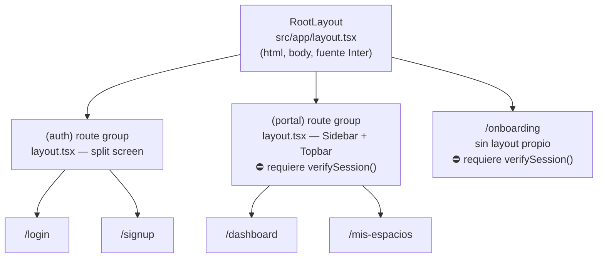
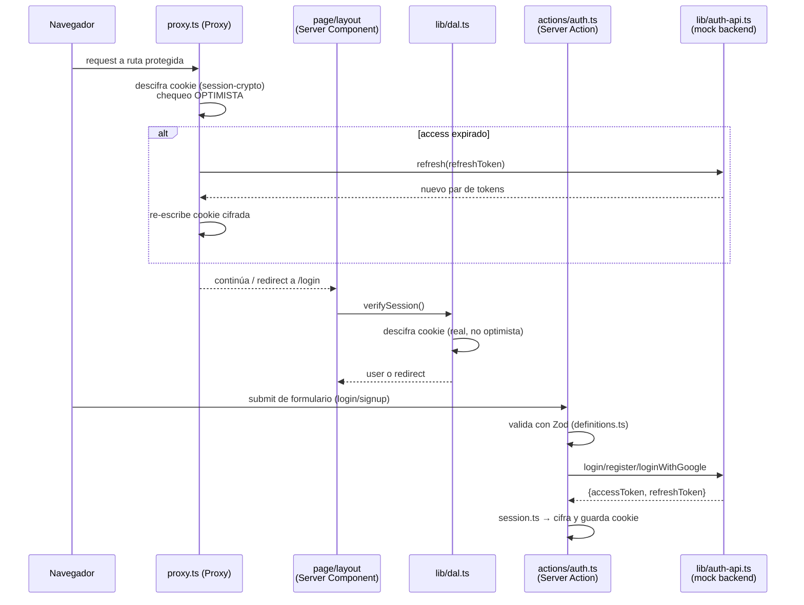

# Arquitectura del Proyecto — RecreAdmin (app-admin-react-next)

> Documento de referencia sobre cómo está compuesto el proyecto y qué patrones de diseño implementa.
> Generado a partir de una inspección del código en `c:\Dev\app-admin-react-next` (rama `develop`).

---

## 1. Visión general

Es un panel de administración construido con **Next.js 16 (App Router)** y **React 19**, actualmente en
**fase mock**: la autenticación está completamente implementada (con un backend simulado en memoria) y
lista para conectarse a un backend real (.NET / ASP.NET Core Identity, ver [`docs/backend-auth-spec.md`](./backend-auth-spec.md)).
El resto de los datos de negocio (KPIs, reservas, espacios) todavía son arrays hardcodeados a la espera
de una fuente de datos real (hay un comentario `// luego vendrán de Supabase` en el dashboard).

> ⚠️ **Nota de convención:** `AGENTS.md` advierte que este proyecto usa Next.js 16, que introduce
> breaking changes respecto a versiones anteriores. La más relevante para este repo: **`middleware.ts`
> fue renombrado a `proxy.ts`** (misma función, nuevo nombre). El proyecto ya sigue esta convención —
> ver [`src/proxy.ts`](../src/proxy.ts).

### Stack principal

| Categoría | Elección | Notas |
|---|---|---|
| Framework | Next.js 16.2.9 (App Router) | Sin Pages Router, sin Route Handlers (`app/api/`) |
| UI | React 19.2.4 | `useActionState`, `useFormStatus`, `cache()` |
| Lenguaje | TypeScript (`strict: true`) | Alias `@/*` → `./src/*` |
| Estilos | Tailwind CSS v4 (`@theme` tokens) | Sin CSS Modules / styled-components |
| Validación | Zod v4 | Esquemas centralizados en `src/lib/definitions.ts` |
| Auth / JWT | `jose` | JWT (mock backend) + JWE (cookie de sesión cifrada) |
| Iconos | `lucide-react` | |
| Estado | Ninguna librería | Server Components + hooks nativos de React 19 |
| Data fetching | Ninguna librería | Sin axios/fetch-wrapper/react-query/SWR (fase mock) |
| Testing | No configurado | Sin Jest/Vitest/Playwright |

No hay gestor de estado global (Redux/Zustand/Recoil), ni librería de formularios (react-hook-form), ni
cliente HTTP genérico: el diseño se apoya deliberadamente en las primitivas nativas de Next 16 / React 19
(Server Actions, Server Components, `useActionState`).

---

## 2. Estructura de carpetas

```
app-admin-react-next/
├── docs/
│   ├── architecture.md          # este documento
│   └── backend-auth-spec.md     # contrato de auth con el equipo backend (.NET)
├── src/
│   ├── proxy.ts                 # Proxy (ex-middleware): chequeo optimista de sesión
│   ├── actions/
│   │   └── auth.ts              # Server Actions: login, signup, loginWithGoogle, logout
│   ├── app/                     # App Router
│   │   ├── layout.tsx           # Root layout (html/body, fuente Inter, metadata)
│   │   ├── page.tsx             # "/" → redirect a /dashboard
│   │   ├── globals.css          # Tailwind v4 + theme tokens
│   │   ├── (auth)/              # route group PÚBLICO
│   │   │   ├── layout.tsx       # layout split-screen (marca + formulario)
│   │   │   ├── login/page.tsx
│   │   │   └── signup/page.tsx
│   │   ├── (portal)/            # route group PROTEGIDO
│   │   │   ├── layout.tsx       # Sidebar + Topbar, exige sesión
│   │   │   ├── dashboard/page.tsx
│   │   │   └── mis-espacios/page.tsx
│   │   └── onboarding/page.tsx  # protegida, fuera de ambos grupos (sin Sidebar/Topbar)
│   ├── components/
│   │   ├── Sidebar.tsx          # compartido, usado solo en (portal)/layout.tsx
│   │   ├── Topbar.tsx           # compartido, usado solo en (portal)/layout.tsx
│   │   ├── auth/                # feature "auth"
│   │   │   ├── LoginForm.tsx
│   │   │   ├── SignupForm.tsx
│   │   │   └── GoogleButton.tsx
│   │   └── onboarding/
│   │       └── OnboardingWizard.tsx
│   ├── lib/                     # infraestructura / dominio
│   │   ├── auth-api.ts          # gateway al backend de auth (mock)
│   │   ├── dal.ts               # Data Access Layer (identidad/autorización)
│   │   ├── definitions.ts       # tipos + esquemas Zod (dominio)
│   │   ├── session.ts           # lectura/escritura de la cookie de sesión
│   │   └── session-crypto.ts    # cifrado/descifrado JWE puro
│   └── gemini/
│       └── onboarding_host_marketplace (1).tsx   # ⚠️ ver nota abajo
```

**Organización por feature + infraestructura compartida:** `components/` agrupa por dominio (`auth/`,
`onboarding/`) más un par de componentes de layout sueltos en la raíz; `lib/` concentra toda la
infraestructura de sesión/auth; no existen carpetas separadas `services/`, `hooks/`, `store/` ni `types/`
— los tipos de dominio viven junto a sus validadores en `lib/definitions.ts`.

> ⚠️ **Código huérfano detectado:** `src/gemini/onboarding_host_marketplace (1).tsx` (769 líneas) no es
> importado por ningún archivo del proyecto (verificado por búsqueda de referencias). Parece un borrador
> generado por IA del mismo dominio que `OnboardingWizard.tsx`. Se recomienda decidir explícitamente si
> se integra o se elimina, para que no se confunda con código en producción.

---

## 3. Routing y layouts (App Router)



- Los **route groups** `(auth)` y `(portal)` agrupan rutas bajo layouts distintos sin afectar la URL
  (los paréntesis no aparecen en el path).
- `/onboarding` está **protegida** pero deliberadamente fuera de `(portal)`, para no mostrar
  Sidebar/Topbar durante el wizard.
- No existen aún `loading.tsx`, `error.tsx`, `template.tsx` ni `not-found.tsx` en ningún segmento —
  vacío a cubrir si se formaliza el manejo de errores/streaming.
- No hay Route Handlers (`app/api/.../route.ts`): toda mutación pasa por **Server Actions**
  (`src/actions/auth.ts`), el patrón recomendado en Next 16 como reemplazo de API routes para
  formularios internos de la propia app.

---

## 4. Capa de datos

El proyecto está en **fase mock explícita** (documentada en el propio código):

```ts
// src/lib/auth-api.ts
// ╔═══ FASE MOCK — Backend simulado ═══╗
// Este archivo imita tu API de auth (login/register/refresh).
// Cuando tengas el backend real, reemplaza el CUERPO de cada función
// por un fetch(process.env.API_BASE_URL + ...). La FIRMA pública
// no debe cambiar...
```

- `src/lib/auth-api.ts` funciona como **gateway/repositorio** de autenticación: expone `login`,
  `register`, `loginWithGoogle`, `refresh` con una firma estable, respaldadas hoy por un
  `Map<string, MockUser>` en memoria (usuario semilla: `admin@recreadmin.com` / `Admin123`).
- El contrato real está especificado en [`docs/backend-auth-spec.md`](./backend-auth-spec.md)
  (endpoints REST sobre ASP.NET Core Identity: `POST /api/usuarios`, `POST /api/auth/login`,
  `/refresh`, `/logout`, `GET /api/auth/google`).
- `next.config.ts` ya declara `images.remotePatterns` para `lh3.googleusercontent.com`, anticipando
  avatares reales de Google.
- `getAccessToken()` en `src/lib/dal.ts` es el punto de extensión previsto para llamar al backend real
  desde Server Components/Actions (`Authorization: Bearer <token>`).
- Los datos de negocio (KPIs del dashboard, reservas, espacios) son constantes tipadas hardcodeadas
  directamente en los `page.tsx` correspondientes, no hay capa `services/`/`repositories/` para ellos
  todavía.

---

## 5. Gestión de estado

No hay una librería de estado global; el proyecto se apoya en las primitivas de **Server Components +
React 19**:

1. **Estado de servidor vía sesión, no store cliente**: `verifySession()` / `getCurrentUser()`
   (`src/lib/dal.ts`) se invocan en cada Server Component que necesita al usuario — no se propaga por
   Context, se recalcula (memoizado) por request.
2. **`useActionState`** para estado de formularios: `LoginForm.tsx` y `SignupForm.tsx` usan
   `const [state, action, pending] = useActionState(login, undefined)` — errores y estado "pendiente"
   viven en el propio componente, alimentados directamente por la Server Action.
3. **`useFormStatus`** en `GoogleButton.tsx` para reflejar el estado `pending` del botón dentro de un
   `<form action={loginWithGoogle}>`.
4. **`useState`/`useEffect`/`useRef` locales** en `OnboardingWizard.tsx` — estado de UI puro de un
   wizard multi-paso (paso actual, OTP, ubicación, etc.), sin compartirse fuera del componente.
5. **`cache()` de React** en `dal.ts` para memoizar `getCurrentUser`/`verifySession`/`getAccessToken`
   por render y evitar volver a descifrar la cookie de sesión varias veces en el mismo request.

No hay `createContext` custom en ningún archivo del proyecto.

---

## 6. Autenticación — arquitectura en capas

Es la parte más madura del proyecto: autenticación **custom** (sin NextAuth/Auth.js), con JWT +
cookie cifrada (JWE) y **defensa en profundidad** en dos niveles.



| Capa | Archivo | Responsabilidad |
|---|---|---|
| Proxy | [`src/proxy.ts`](../src/proxy.ts) | Chequeo **optimista** (sin verificación fuerte): descifra la cookie, refresca el access token si expiró, redirige `/login` ↔ `/dashboard`. |
| Cripto | [`src/lib/session-crypto.ts`](../src/lib/session-crypto.ts) | Cifrado/descifrado puro (JWE con `jose`, `dir` + `A256GCM`), sin depender de `next/headers` — reutilizable en el Proxy (Edge) y en Server. |
| Cookie | [`src/lib/session.ts`](../src/lib/session.ts) | Escribe/lee/borra la cookie `session` vía `next/headers` `cookies()` — solo Server Actions/Components. |
| DAL | [`src/lib/dal.ts`](../src/lib/dal.ts) | Fuente única de verdad de identidad: `getCurrentUser`, `verifySession` (redirige si no hay sesión), `requireRole(...roles)` (RBAC), `getAccessToken`. Todo memoizado con `cache()`. |
| Gateway | [`src/lib/auth-api.ts`](../src/lib/auth-api.ts) | Mock del backend de auth: firma JWT (`HS256`, access 15 min / refresh 7 días). |
| Actions | [`src/actions/auth.ts`](../src/actions/auth.ts) | `"use server"` — expone `login`, `signup`, `loginWithGoogle`, `logout` a los formularios cliente, validando con Zod. |

**Principio de diseño explícito en el código** (comentado en `proxy.ts`): *"La seguridad REAL vive en el
DAL y en cada acción"* — el Proxy solo optimiza UX (evita un parpadeo/redirect tardío), nunca es la
única barrera de seguridad. Además:

- Cookie `session` es `httpOnly`, `secure` en producción, `sameSite: lax`, y el payload va **cifrado**
  (JWE), no solo firmado — ni el rol ni el email son legibles desde el cliente.
- RBAC simple: dos roles (`"admin" | "staff"`, definidos en `definitions.ts`) verificados con
  `requireRole(...roles)`.
- Login con Google está simulado (upsert en el mock); el flujo real (OAuth dirigido por backend, código
  de un solo uso, nunca tokens en la URL) está especificado en `docs/backend-auth-spec.md`.

---

## 7. Componentes

- **Organización híbrida**: por feature (`components/auth/`, `components/onboarding/`) + compartidos de
  layout sueltos en la raíz (`Sidebar.tsx`, `Topbar.tsx`).
- **Naming**: `PascalCase.tsx`, named exports para componentes reutilizables
  (`export function LoginForm()`), default export reservado para los archivos que Next.js exige
  (`page.tsx`, `layout.tsx`).
- **Server vs Client explícito**: los componentes interactivos declaran `"use client"` en la primera
  línea (`Sidebar.tsx`, `LoginForm.tsx`, `SignupForm.tsx`, `GoogleButton.tsx`, `OnboardingWizard.tsx`);
  el resto (layouts, páginas de `(portal)`, `Topbar.tsx`) son Server Components por defecto.
- **Sub-componentes privados in-file** cuando son de un solo uso: `NavLink` dentro de `Sidebar.tsx`,
  `SpaceCard`/`StatusBadge` dentro de `mis-espacios/page.tsx`, `GoogleIcon`/`GoogleSubmit` dentro de
  `GoogleButton.tsx` — evita fragmentar en archivos componentes que no se reutilizan.
- No hay atomic design formal (no hay `atoms/molecules/organisms`).

---

## 8. Patrones de diseño identificados

| Patrón | Dónde | Ejemplo |
|---|---|---|
| **Data Access Layer (DAL)** | `src/lib/dal.ts` | Centraliza toda lectura de identidad/autorización; patrón recomendado por la propia guía de autenticación de Next.js para App Router. |
| **Repository / Gateway** | `src/lib/auth-api.ts` | Firma pública estable (`login`, `register`, `refresh`) independiente de la implementación interna (mock hoy, `fetch` real mañana). |
| **Middleware / Proxy pipeline** | `src/proxy.ts` | Intercepta requests antes de la ruta, con `matcher` para filtrar paths — pipeline clásico de request/response. |
| **Guard / gatekeeper vía Server Component** | `src/app/(portal)/layout.tsx` | Resuelve `await verifySession()` y pasa `user` como prop a sus hijos (`<Sidebar user={user} />`), sin usar Context. |
| **Container / Presentational (parcial)** | `dashboard/page.tsx`, `onboarding/page.tsx` | Páginas Server Component obtienen datos/sesión y los pasan a componentes cliente presentacionales (`OnboardingWizard`, `Sidebar`, `Topbar`). |
| **Memoization / request-scoped cache** | `getCurrentUser`, `verifySession`, `getAccessToken` en `dal.ts` | Envueltas en `cache()` de React para no re-descifrar la sesión múltiples veces por render. |
| **Configuración tipo singleton** | `session-crypto.ts` | `SESSION_COOKIE`, `SESSION_MAX_AGE` exportadas una vez y reutilizadas por `session.ts` y `proxy.ts`. |
| **Formularios declarativos (React 19)** | `LoginForm.tsx`, `SignupForm.tsx`, `GoogleButton.tsx` | `useActionState` + `useFormStatus` en vez de manejar `onSubmit`/estado a mano. |
| **Discriminated union de dominio** | `Space` en `mis-espacios/page.tsx` | Unión discriminada por `status: "activo" \| "inactivo" \| "revision"` — el compilador exige los campos correctos según el estado. |
| **Validación centralizada con Zod** | `src/lib/definitions.ts` | Esquemas (`LoginSchema`, `SignupSchema`) como fuente única de verdad de forma/tipos, consumidos tanto por Server Actions como por el dominio. |

**No detectados** en el código actual: HOCs, render props, compound components (`Component.SubComponent`),
factories formales (clases), ni Context API custom.

---

## 9. Configuración y calidad

- **TypeScript estricto** (`tsconfig.json` → `strict: true`), alias `@/*` → `./src/*`.
- **ESLint** flat config (`eslint.config.mjs`), extiende `eslint-config-next` (`core-web-vitals` +
  `typescript`); en Next 16 el lint corre standalone vía ESLint CLI (no `next lint`).
- **Tailwind CSS v4**: theme tokens custom vía `@theme` en `src/app/globals.css` (paleta, tipografía,
  sombras `--shadow-soft`/`--shadow-card`). Sin CSS Modules ni styled-components.
- **Sin testing configurado**: no hay Jest/Vitest/Playwright/Cypress ni archivos `*.test.*`/`*.spec.*`.
  Riesgo a considerar dado que la lógica de auth (cripto, RBAC, refresh) es la parte más crítica del
  código y hoy no tiene cobertura automatizada.
- **Variables de entorno** (`.env.local`, no versionado): `SESSION_SECRET`, `MOCK_JWT_SECRET`,
  `API_BASE_URL` (comentado, pendiente del backend real).
- **`next.config.ts`** minimalista: solo `images.remotePatterns` para avatares de Google.

---

## 10. Brechas y deuda técnica a considerar

1. **`src/gemini/onboarding_host_marketplace (1).tsx`** — código huérfano sin referencias; decidir si
   se integra o se elimina.
2. **Sin tests** para la capa de auth (cripto JWE, refresh de tokens, RBAC) — es la lógica más sensible
   del repo y no tiene cobertura.
3. **Sin `error.tsx`/`loading.tsx`/`not-found.tsx`** en ningún segmento de `app/` — no hay manejo
   formal de errores ni estados de carga con streaming.
4. **Duplicación menor**: la función `initials(name)` está repetida en `Sidebar.tsx` y `Topbar.tsx` —
   candidata a extraer a un util compartido (p. ej. `src/lib/format.ts`).
5. **Datos de negocio hardcodeados** (KPIs, reservas, espacios) directamente en los `page.tsx` — sin
   capa `services/`/`repositories/` propia todavía; útil tenerlo presente al conectar Supabase/backend
   real para decidir dónde vivirá esa capa.
